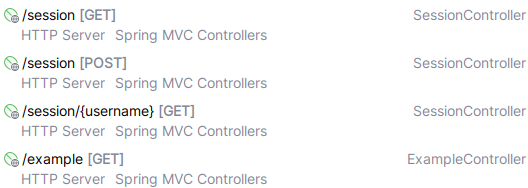

# Стартер

## Описание

### Подключение

Стартер представляет собой готовую, но гибкую конфигурацию управления сессиями. Он описан в модуле `blacklist-spring-boot-starter`

Для подключения к проекту стартер был опубликован в локальном репозитории Maven:
```groovy
implementation 'by.harlap.course.starter:blacklist-spring-boot-starter:0.0.1'
```

### Хранилище

Для хранения сессий и чёрного списка юзернеймов стартером предоставляются бины с интерфейсами `SessionStorage` и `BlacklistStorage` (реализации `InMemorySessionStorage` и `InMemoryBlacklistStorage`). При желании бины можно переопределить: реализовать свой источник хранения сессий и чёрного списка.

### Бизнес-логика

Логика взаимодействия с сессиями и чёрным списком предоставляются бинами `SessionService` и `BlacklistService`. Их реализация по умолчанию (`DefaultSessionService` и `DefaultBlacklistService`) также может быть переопределена.

### Внедрение сессии

Для хранения сессии и имени пользователя был реализован класс SessionHolder:
```java
@Getter
@ToString
public class SessionHolder {

    public SessionHolder(String username, HttpSession session) {
        this.username = username;
        this.sessionID = session.getId();
        this.started = Instant.ofEpochMilli(session.getCreationTime());

        this.session = session;
    }

    private final String username;
    private final String sessionID;
    private final Instant started;

    @JsonIgnore
    @ToString.Exclude
    private final HttpSession session;
}
```

Для внедрения объекта SessionHolder в метод была реализована аннотация `@SessionProvided`, постпроцессор `SessionProvidedBeanAnnotationPostProcessor` и обработчик для проксируемых объектов `SessionHolderInterceptor`. В результате, чтобы внедрить сессию в нужный метод, достаточно написать следующий код:
```java
@Service
@Log4j2
public class ExampleService {
    
    // 1. Постпроцессор обнаружит аннотацию и создаст cglib-прокси для класса ExampleService

    // 2. При вызове метода exampleService.generateRandomString(null) будет выполнен код прокси-объекта,
    //    который подставит в список аргументов объект SessionHolder из хранилища
    @SessionProvided
    public String generateRandomString(SessionHolder sessionHolder) {
        if (sessionHolder == null) {
            log.warn("Session holder has not been provided");
        } else {
            log.warn("Session holder has been provided: {}", sessionHolder);
        }

        return UUID.randomUUID().toString();
    }
}
```

### Инициализация чёрного списка

Для инициализации чёрного списка используется бин `PredefinedBlacklistProvider`. При наличии в `application.yml` свойства `application.sessions.blacklist` используется реализация `PropertyBasedBlacklistProvider`. При отсутсвии свойства используется реализация `EmptyBlacklistProvider`. При желании можно расширить имеющуюся или предоставить свою реализацию `PredefinedBlacklistProvider`.

### Очистка сессий каждую полночь

При установке свойства `application.sessions.schedule-invalidation: true` в контексте будет присутствовать бин `SessionCleanerService`, который каждую полночь завершает активные сессии.

### Обработка исключений

Кроме того, стартер предоставляет для обработки исключения `SessionNotFoundException` и `UserBlockedException`.

## Проверка

1. Ниже приведены эндпоинты проекта, реализованного для проверки стартера
    
2. Для создания сессии используется эндпоинт `POST /session` с телом `{ "username": "vasya" }`
3. Для получения сессии текущего пользователя используется эндпоинт `GET /session`
4. Для получения сессии определённого пользователя используется эндпоинт ``
